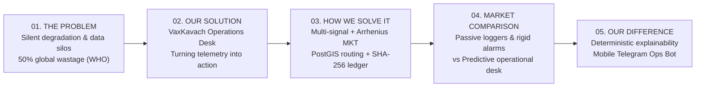
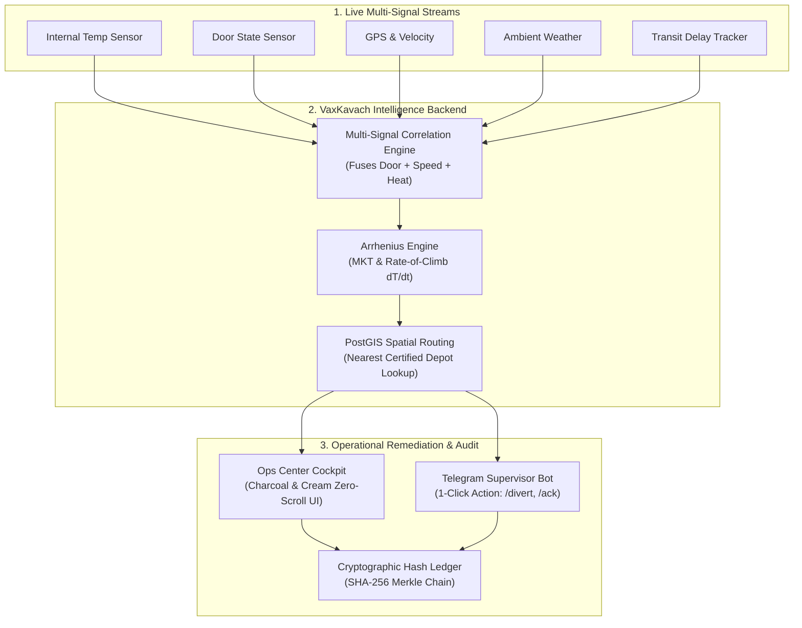
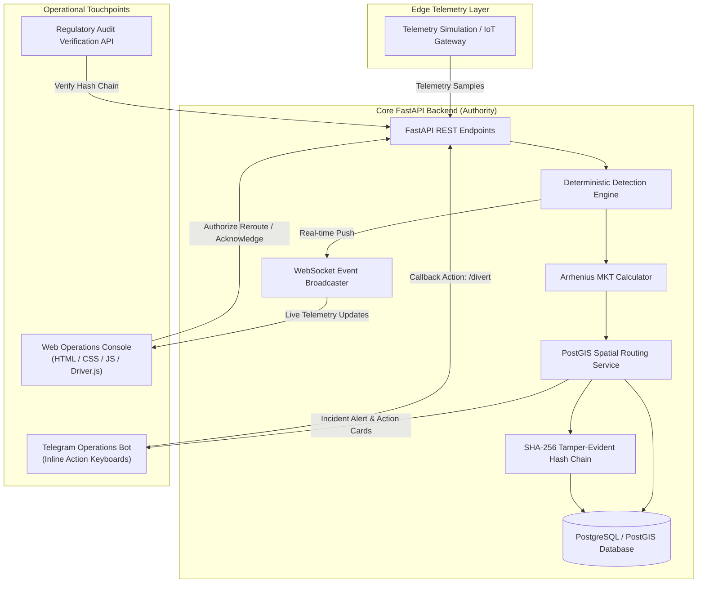
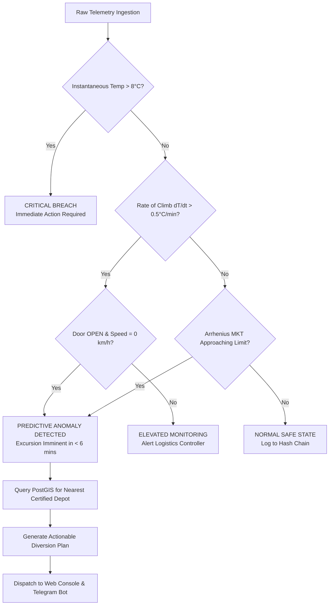

# VaxKavach: Hackathon Pitch Plan & Technical Defense
**Smart India Hackathon 2026 — Problem Statement 5: Autonomous Operations Intelligence Desk**  
*Motto: “Every degree, accounted for.”*

---

## Executive Summary & Core Pitch Pillars



---

## Section 1: The Five Core Questions

### 1. What is the Problem?

#### Simple Explanation:
> **Vaccines die silently in the heat, and existing monitoring systems only sound the alarm after they are already spoiled.**

#### Elaborate Explanation:
* **The Biological Reality**: Vaccines are fragile biological proteins and mRNA strands. When exposed to temperatures outside their strict $+2^\circ\text{C}$ to $+8^\circ\text{C}$ window, they undergo irreversible thermal denaturation.
* **The Silent Threat**: A spoiled vaccine looks identical to a potent one. It arrives on time, the vials look intact, and the barcode scans green. When administered, it produces zero immune response—leaving children and citizens vulnerable to disease outbreaks.
* **The Scale of Wastage**: The World Health Organization (WHO) estimates that **over 50% of vaccines are wasted globally each year** due to cold-chain breakdowns. In India’s Universal Immunization Programme (UIP), a single spoiled truckload represents **INR 8+ Crore ($1M+)** in product loss, procurement penalties, and public health risk.
* **The Fatal Flaw of Today's Systems**: Current logistics operators monitor shipments through disconnected data silos (one screen for GPS, another for temperature logs, a third for driver phone calls). Alerts are based on static thresholds ($>8^\circ\text{C}$), meaning alarms only sound *after* the cargo is already ruined.

---

### 2. What is Our Solution?

#### Simple Explanation:
> **VaxKavach is an autonomous operations intelligence desk that turns raw cold-chain sensor data into immediate, life-saving operational decisions before vaccines spoil.**

#### Elaborate Explanation:
VaxKavach is an active operations cockpit designed around six deterministic steps:
$$\text{WATCH} \longrightarrow \text{SPOT} \longrightarrow \text{EXPLAIN} \longrightarrow \text{RECOMMEND} \longrightarrow \text{ACT} \longrightarrow \text{RECORD}$$

It unites fleet controllers, field drivers, and regulatory inspectors on a single platform:
* **For Fleet Controllers**: A calm, high-efficiency command center (zero-scroll UI in a clinical charcoal & cream palette).
* **For Field Supervisors**: A real-time **Telegram Operations Bot** delivering actionable incident cards with one-click decision buttons (`/authorize`, `/divert`, `/acknowledge`).
* **For Regulatory Inspectors**: A mathematically verifiable, tamper-evident audit ledger proving every degree the vaccine experienced from origin to destination.

---

### 3. How We Are Solving the Problem

#### Simple Explanation:
> **We combine 5 different sensor streams, use real chemical physics to calculate how much the vaccine has degraded, automatically find the nearest backup cold-storage depot on a live map, and log every action into a tamper-proof digital ledger.**

#### Elaborate Explanation (The 4-Engine Architecture):

1. **Multi-Signal Correlation Engine**:
   - Instead of evaluating temperature in isolation, VaxKavach correlates 5 operational signals simultaneously: Internal Temperature, Rate of Climb ($dT/dt$), Door State, Vehicle Speed/GPS, and External Ambient Weather.
   - *Example*: A temperature of $5.8^\circ\text{C}$ is within the nominal $2\text{--}8^\circ\text{C}$ band. But if the cargo door has been open for $>4$ minutes, the truck is stationary on Highway 48, and ambient temperature is $36^\circ\text{C}$, VaxKavach detects an emerging emergency minutes before the threshold is breached.

2. **Mean Kinetic Temperature (Arrhenius Equation)**:
   - Arithmetic averages mislead because chemical degradation accelerates exponentially with temperature.
   - We implement the pharmaceutical-standard **Arrhenius MKT formula** ($E_a = 83.144\text{ kJ/mol}$):
     $$T_K = \frac{\Delta H / R}{-\ln\left(\frac{1}{n} \sum_{i=1}^{n} e^{-\frac{\Delta H}{R \cdot T_i}}\right)}$$
   - This provides the operator with the exact biological stress experienced by the active antigens over time.

3. **Automated Geospatial Diversion (PostGIS Engine)**:
   - When an excursion cannot be stabilized on the road, VaxKavach executes spatial nearest-neighbor queries against certified cold-chain depots, verifies cooling bay capacity, and calculates turn-by-turn diversion routes.

4. **Cryptographic SHA-256 Audit Trail**:
   - Every telemetry frame, alert, operator click, and reroute authorization is linked in an append-only hash chain:
     $$\text{Hash}_n = \text{SHA256}(\text{Data} + \text{Timestamp} + \text{Operator ID} + \text{Hash}_{n-1})$$
   - Modifying any past temperature reading invalidates the chain, ensuring compliance with WHO Good Distribution Practices (GDP) and FDA 21 CFR Part 11.

---

### 4. What Are the Existing Solutions in the Market?

#### Simple Explanation:
> **Today's market has passive USB data-loggers that only tell you vaccines spoiled after you open the box, and generic GPS trackers that send loud alarms without telling you where to take the truck.**

#### Elaborate Explanation:
1. **Passive USB / PDF Data Loggers (e.g., Sensitech TempTale, Berlinger, LogTag)**:
   - *Mechanism*: Placed inside boxes; at the destination clinic, a health worker plugs it into a PC to read a PDF graph.
   - *Fatal Flaw*: **Post-mortem only.** By the time the PDF is read, the cargo is already ruined and the truck has departed.
2. **First-Gen Active IoT Loggers (e.g., Roambee, Tive, Emerson Go)**:
   - *Mechanism*: Battery-powered cellular/GPS trackers pushing temperature readings to a cloud portal every 15 minutes.
   - *Fatal Flaw*: **Threshold-only alarms.** They beep when temperature crosses $8^\circ\text{C}$, but offer no multi-sensor correlation, no Arrhenius MKT degradation modeling, and no automated routing to certified backup cold rooms.
3. **Generic Fleet Telematics (e.g., LocoNav, WheelsEye, Samsara)**:
   - *Mechanism*: Standard vehicle tracking for diesel theft, driver speed, and truck coordinates.
   - *Fatal Flaw*: Built for general freight, not biologicals. They have zero understanding of vaccine stability curves or cold-storage depot networks.

---

### 5. How Are We Different?

#### Simple Explanation:
> **Existing tools give operators more raw numbers; VaxKavach gives operators immediate, evidence-backed decisions.**

#### Comparative Differentiation Matrix:

| Feature / Dimension | Traditional Market Loggers (Sensitech / Roambee) | Standard Fleet GPS Trackers | **VaxKavach Operations Intelligence Desk** |
| :--- | :---: | :---: | :---: |
| **Detection Method** | Static threshold breach ($>8^\circ\text{C}$) | None / basic probe alert | **Multi-Signal Correlation + Rate-of-Climb ($dT/dt$)** |
| **Biological Impact** | None (Simple arithmetic mean) | None | **Arrhenius Mean Kinetic Temperature (MKT)** |
| **Remediation Support** | None (Operator panics manually) | None | **Automated PostGIS Rerouting to Certified Depots** |
| **Mobile Field Response** | Email or SMS alert link | SMS alert | **Interactive Telegram Bot with 1-Click Action Cards** |
| **Data Integrity** | Standard mutable database records | Mutable SQL tables | **Cryptographic SHA-256 Tamper-Evident Hash Chain** |
| **Explainability** | Raw chart or black-box score | Raw GPS pin | **Deterministic Causality (Exact What, Why, & Where)** |

---

## Section 2: Flowcharts & Architecture Diagrams (Mermaid)

### Flowchart 1: End-to-End Operational Intelligence Pipeline


---

### Flowchart 2: System Architecture & Data Flow


---

### Flowchart 3: Live Incident Sequence (VK-1042 Chennai → Vellore)
```mermaid
sequenceDiagram
    autonumber
    actor Driver as Driver (VK-1042)
    participant Sensors as Onboard Sensors
    participant Backend as VaxKavach Backend
    participant Console as Desk Operator
    participant Bot as Supervisor (Telegram)
    participant Depot as Sriperumbudur Depot

    Note over Driver,Sensors: 08:13 - Truck halts on NH48 in 36°C ambient heat
    Sensors->>Backend: Temp: 4.2°C -> 5.4°C | Speed: 0 km/h
    Note over Sensors: 08:14 - Cargo door opened (>4 mins)
    Sensors->>Backend: Door: OPEN | dT/dt: +0.8°C/min
    Backend->>Backend: Correlate Door + Speed + Heat; Compute Arrhenius MKT
    Note over Backend: 08:15 - Active excursion flagged before 8°C breach
    Backend->>Backend: PostGIS query finds Sriperumbudur Depot (11.4 km, 18 min)
    Backend-->>Console: Push High-Priority Diversion Recommendation
    Backend-->>Bot: Push Interactive Incident Card to Smartphone
    Note over Bot: 08:17 - Supervisor clicks '/authorize' on Telegram
    Bot->>Backend: POST /api/shipments/VK-1042/reroute
    Backend->>Backend: Commit SHA-256 hash block to audit ledger
    Backend-->>Driver: Dispatch emergency reroute instructions to truck
    Note over Driver,Depot: 08:34 - Shipment docked into auxiliary refrigeration at 3.8°C
    Backend-->>Console: Incident Marked RESOLVED (Duration: 21 mins, INR 1.2 Cr Saved)
```

---

### Flowchart 4: Problem Detection Logic (Deterministic vs Reactive)


---

## Section 3: The 5-Minute Verbatim Pitch Script

*(Target Pace: 130 words/minute | Total Time: 5 Minutes | Total Words: ~650)*

---

### [0:00 – 1:00] The Problem: The Invisible Cold-Chain Crisis
> "Good morning, respected judges. 
>
> In standard freight logistics, when a truck arrives at its destination, the job is complete. But in vaccine logistics, **arrival does not equal success**. 
>
> Vaccines are living biopharmaceuticals. If temperature rises even a few degrees above their safe $+2^\circ\text{C}$ to $+8^\circ\text{C}$ window, active proteins denature and the antigen dies. Yet, a heat-damaged vaccine looks completely normal. It arrives on time, the vials look intact, but when administered to a child, it offers zero protection. 
>
> The World Health Organization estimates that **over 50% of vaccines are wasted globally every single year** due to cold-chain breakdowns. In India, a single compromised truckload causes over INR 8 Crore ($1M+) in direct financial loss and leaves thousands of citizens vulnerable.
>
> Why does this keep happening? Because current market solutions are **disconnected, passive, and purely reactive**. Operators juggle five separate screens—GPS on one, temperature on another, WhatsApp on a third. Alerts only sound after a rigid $8^\circ\text{C}$ threshold is breached—when it is already too late."

---

### [1:00 – 2:00] What is Our Solution?
> "To solve Problem Statement 5, we engineered **VaxKavach**—an autonomous operations intelligence desk for vaccine cold chains. 
>
> Our philosophy is simple: **Every degree, accounted for.** 
>
> VaxKavach does not simply show graphs. It turns thousands of raw operational signals into trusted, real-time decisions before vaccines are compromised.
>
> Instead of a noisy, flashing dashboard, we built an industrial command center that operates on a continuous, four-pillar intelligence loop:
> 1. **CORRELATE** multiple telemetry streams,
> 2. **IDENTIFY** root-cause anomalies using chemical physics,
> 3. **RECOMMEND** certified emergency diversions, and
> 4. **AUDIT** every single event in a tamper-evident cryptographic ledger."

---

### [2:00 – 3:15] How We Are Solving It (The VK-1042 Live Demonstration)
> "Let us show you how this works in practice with our live demonstration: Shipment VK-1042 carrying critical MMR vaccines from Chennai Central to Vellore.
>
> - **At 08:13**, the truck slows to a halt in high ambient heat ($36^\circ\text{C}$) on Highway 48.
> - **At 08:14**, the cargo door opens and internal temperature starts rising at $0.8^\circ\text{C}$ per minute. A standard market logger does nothing because the temperature is only $5.4^\circ\text{C}$—well below the $8^\circ\text{C}$ alarm limit. But VaxKavach's **Multi-Signal Correlation Engine** correlates the stationary GPS, the open door, and the rapid rate-of-climb, flagging an active thermal breach immediately.
> - Next, our backend runs the **Arrhenius Mean Kinetic Temperature** formula to quantify the actual biological degradation on the vaccines.
> - **At 08:15**, our spatial **PostGIS engine** evaluates certified cold storage facilities in the corridor, identifies Sriperumbudur Depot 11.4 km away, and plans an emergency diversion route.
> - Instantly, an interactive card is pushed to the supervisor's **Telegram Operations Bot**. With a single tap on mobile or desk, the reroute is authorized.
> - By **08:34**—in just 21 minutes—the cargo is safely docked into auxiliary refrigeration. Loss prevented: INR 1.2 Crore."

---

### [3:15 – 4:15] Market Landscape & How We Are Different
> "Judges often ask: *'How is this different from existing solutions like Sensitech or Roambee?'*
>
> 1. **Passive Loggers vs Active Intelligence**: Devices like Sensitech TempTale are post-mortem loggers. You plug them into a USB port after arrival to discover your vaccines spoiled three days ago. VaxKavach prevents failures while the truck is still on the road.
> 2. **Static Thresholds vs Physical Chemistry**: Competitors alert on simple temperatures. VaxKavach calculates Arrhenius MKT to reflect true biological shelf-life degradation.
> 3. **Dead-End Alarms vs PostGIS Remediation**: Existing trackers beep loudly but leave the operator stranded. VaxKavach automatically coordinates the nearest verified cold room with real spatial routing.
> 4. **Mutable Records vs Cryptographic SHA-256 Ledger**: While standard systems save editable SQL records, VaxKavach seals every telemetry frame, operator action, and diversion into an immutable hash chain—ensuring full compliance with WHO Good Distribution Practices and FDA 21 CFR Part 11."

---

### [4:15 – 5:00] Scalability, Impact & Closing
> "VaxKavach is engineered as an enterprise-grade platform using FastAPI, PostgreSQL, PostGIS, WebSockets, and a clinical, low-fatigue design system. It is architected to integrate seamlessly with the Government of India’s **eVIN** and **U-WIN** immunization platforms.
>
> An operator doesn't need another confusing dashboard. They need to know: **What is happening? Why is it happening? Where do I divert the shipment? And can I prove it to a health inspector?**
>
> VaxKavach answers all four. 
>
> **Every degree, accounted for.** 
>
> Thank you, and we are now open for your questions."

---

## Section 4: Slide-by-Slide Presentation Deck Alignment

| Slide # | Slide Title | Visual Assets & Key Talking Points |
| :---: | :--- | :--- |
| **Slide 1** | **Title Slide** | • Title: `PS 5 — Autonomous Operations Intelligence Desk`<br>• Team: Anirud A (Lead), Anvitha Mohan, Arpit Panigrahi, Harkeerat Singh<br>• Core Hook: *"In vaccine logistics, arrival does not equal success."* |
| **Slide 2** | **The Vision / Hook** | • Teal `ALERT` badges + VaxKavach branding<br>• *"Preventing failures before they happen — Protecting vaccines, ensuring WHO/FDA compliance, and preventing INR 8+ Cr losses per incident."* |
| **Slide 3** | **Cold-Chain Failures: Silent & Costly** | • 3 Core Bottlenecks: `DISCONNECTED DATA SILOS`, `INR 8+ CR / $1M+ PER INCIDENT`, `THRESHOLD-ONLY REACTIVITY`.<br>• Highlight the clinical risk of silent degradation and the 50% WHO wastage statistic. |
| **Slide 4** | **Operations Intelligence Desk: 4 Pillars** | • Detailed 4-stage engine: `Correlate`, `Identify`, `Recommend`, `Audit`.<br>• *"Watch, Spot, Explain, Recommend, Act, and Record — Every degree, accounted for."* |
| **Slide 5** | **End-to-End Intelligence Flow** | • Illustrated medical flow: `Events` $\to$ `Correlate` $\to$ `AI Assessment` $\to$ `Recommend` $\to$ `Audit`. |
| **Slide 6** | **Incident Walkthrough (VK-1042)** | • Live Chennai $\to$ Vellore case study: 08:13 Spike $\to$ 08:14 Door Open $\to$ 08:15 PostGIS Depot Lookup $\to$ 08:17 Telegram Authorization $\to$ 08:34 Resolution.<br>• Metrics: `RESOLVED` • `21 MIN` • `INR 1.2 CR LOSS PREVENTED`. |
| **Slide 7** | **Why This is the Best Fit for PS 5** | • Side-by-side comparison table: Basic Monitoring vs VaxKavach Intelligence Desk.<br>• Emphasize explainable physical chemistry, spatial routing, and cryptographic ledger. |
| **Slide 8** | **Thank You** | • Closing punchline: *"VaxKavach — Every degree, accounted for."*<br>• Ready for Q&A defense. |
